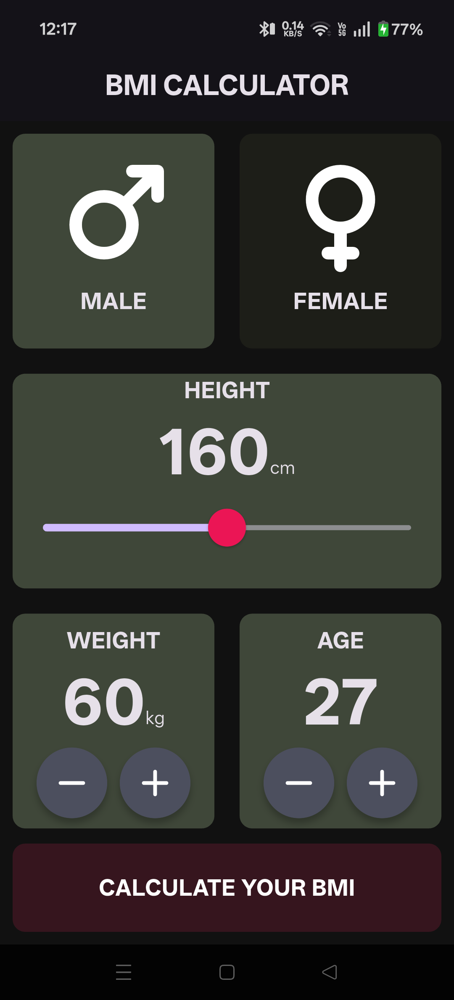
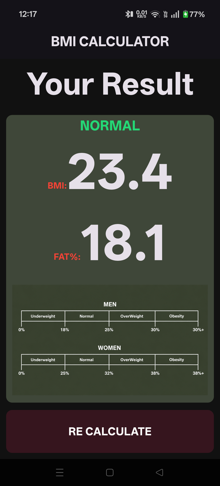

# BMI-Calculator

Application to compute BMI and approximate body fat percentage based on user-provided details such as height, weight, age, and gender. The app analyzes the derived values and presents categorized health results including Underweight, Normal, Overweight, and Obese ranges.

## Screenshots

